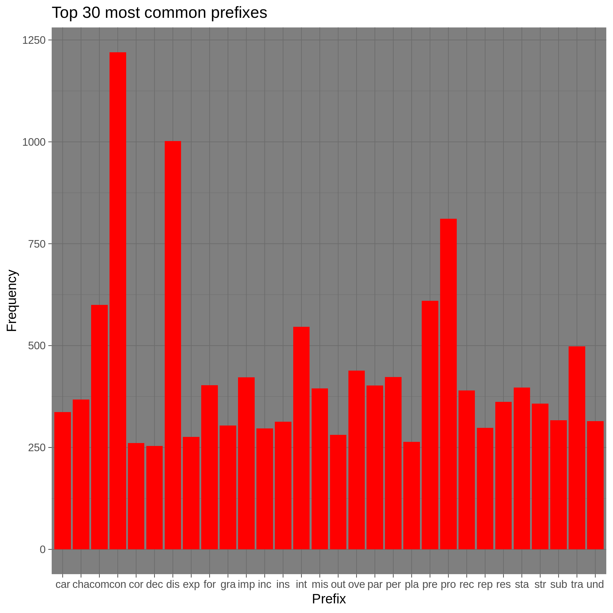
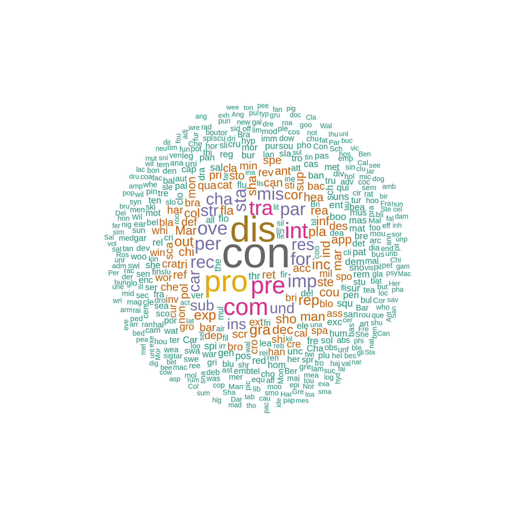

# Introduction
In this document, I will attempt to to do the following:

* Compute and plot a histogram of the top `30` most common prefixes.
* Plot a word map of all the prefixes.
* Make some comments

## Load in the requried data

```r
 data <- read.delim("top_30_prefixes.tsv")
```

## Visualize the prefixes histogram
To visualize the histogram, I took the list of the top `30` prefixes and their frequencies and plotted their distribution.
Here, prefixes are defined as being the first three letters of the word.

Please see below:



## Visualize the word cloud
To visualize the wordcloud, I used the `wordcloud` package. For my purposes I only selected prefixes that a frequency of at least $50$ to make computations much easier. Seee below for plot:




## General Comments
This is actually pretty cool. It seems that `con` is the most common three letter prefix. This can be seen from the word cloud and the histogram. 
I wonder if this is actually the case. Lets do a more rigorous test: "con". It indeed is `con` that is the most frequent three letter prefix. I wonder how this will change if you increase the number of letter for a prefix.


